# Meridian — Dossiê de Onboarding Técnico-Operacional (Nexus)

**Para:** Agente Nexus (Coordenação Técnico-Operacional)  
**Abaixo de:** CEO Astra (GPT-6 ASTRA) — Diretoria Executiva da Meridian Technologies  
**Emitido por:** Orion (Lead Tech Orchestrator / Head of Data Engineering)  
**Data:** 14 de Setembro de 2026  
**Status de Governança:** 🛡️ **FAIL-CLOSED ESTRITO PRESERVADO** (Zero chamadas reais a corretoras / `real_broker_calls == 0`)  

---

## 1. Visão Geral e Contexto do Sistema

O **Meridian** é uma plataforma de trading algorítmico, engenharia quantitativa e gestão de risco para ativos negociados na **B3 (Brasil, Bolsa, Balcão)**.

O sistema opera atualmente em modo estrito de **Paper Trading / Simulação Controlada**. Nenhuma ordem é enviada a corretoras reais ou à infraestrutura de produção da B3. Todas as rotas e módulos operam sob o princípio de **Fail-Closed**: na ausência de evidência imutável, integridade verificada de cotações ou falha de conectividade, qualquer operação financeira é bloqueada e valores patrimoniais retornam `null` / `unavailable`.

---

## 2. Estrutura de Diretórios e Componentes

```text
Meridian/
├── backend/
│   └── app/
│       ├── main.py              # Aplicação FastAPI, lifespan e rotas HTTP/WebSocket
│       ├── worker_state.py      # Estado de supervisão e contabilidade de restarts
│       ├── runtime_config.py    # Carregamento e validação de config/settings.yaml
│       ├── security.py          # Autenticação fail-fast via API_KEY
│       ├── agents/              # MarketAnalyst, RiskManager, ExecutorAgent
│       ├── data/                # Banco SQLite (WAL), feed de preços e cache
│       └── markets/             # Abstrações de mercado (B3, PaperBroker)
├── trading_bot/
│   ├── core/                    # Coordinator central, Scheduler, Telegram, LLM Client
│   ├── data/                    # Lakehouse, ValuationSnapshot, MetricProvenance, COTAHIST
│   ├── signals/                 # Motor Donchian Breakout, validação de inputs
│   ├── risk/                    # CircuitBreaker, PositionSizing (Kelly)
│   ├── execution/               # PaperSession (idempotente), OrderManager
│   └── analytics/               # Atribuição de performance, motores quantitativos
├── frontend/                    # Painel de controle React 18 / Vite
│   ├── src/                     # App.jsx, CapitalVault, DecisionLog, ActiveTradeDetails
│   └── honesty.test.mjs         # Suíte de integridade do dashboard (Node test runner)
├── scripts/                     # Utilitários operacionais e daemons headless
│   ├── run_coordinator.py       # Daemon de supervisão central de background workers
│   ├── run_paper_session.py     # Execução de sessão paper auditável
│   └── evaluate_research_models.py # Avaliação quantitativa com contrato temporal PIT
├── config/                      # Universo de ativos e assinaturas formais de dados
├── docs/                        # Pareceres da CEO Astra, especificações e relatórios
└── tests/                       # 769 testes automatizados (unitários, integração, E2E)
```

---

## 3. Entrypoints Operacionais

### A. Interface Web e API Backend
```powershell
uvicorn backend.app.main:app --host 127.0.0.1 --port 8000
```
- Requer variável de ambiente `API_KEY` configurada.
- O `lifespan` inicializa o banco SQLite, valida credenciais e dispara o `CentralCoordinator`.

### B. Daemon Autônomo de Supervisão (Headless)
```powershell
$env:API_KEY="sua_chave"; python scripts/run_coordinator.py [--duration SECS] [--dry-run]
```
- Inicia e supervisiona `ai_committee_worker` (entradas) e `exit_loop` (stops/saídas) em background.
- Suporta encerramento gracioso via `SIGINT`/`SIGTERM` e emite relatório estruturado ao fechar.

### C. Sessão Paper Auditável Reproduzível
```powershell
python scripts/run_paper_session.py --ticks 10 --db-path data/trading_bot.db
```
- Executa o ciclo fechado: Sinal → RiskManager → Executor → Journal `.jsonl` → Reconciliação.

### D. Painel Frontend
```powershell
cd frontend
npm run dev
```
- Interface de monitoramento com salvaguardas honestas: exibe `FailClosedBanner` em desconexão e bloqueia saques/depósitos sem confirmação de integridade.

---

## 4. Fluxo de Dados e de Execução

```mermaid
graph LR
    A[B3 / COTAHIST / Bacen] --> B[Lakehouse Storage - Raw Bytes Exclusive Write]
    B --> C[Approval Registry - config/data_approvals.json]
    C --> D[SnapshotValuation - Frozen Prices & Evidence]
    D --> E[Signals Engine - Donchian Breakout + IBOV Trend]
    E --> F[RiskManager - Kelly Fraction & Correlation Guard]
    F --> G[ExecutorAgent - Paper Mode Only]
    G --> H[Execution Journal .jsonl & SQLite WAL]
    H --> I[Reconciler - Continuous Integrity Check]
    I --> J[CentralCoordinator & Watchdog]
```



---

## 5. Módulos Críticos e Regras de Risco

1. **`CircuitBreaker` (`trading_bot/risk/circuit_breaker.py`)**:
   - Limite de perda diária: 3%.
   - Drawdown máximo desde inception: 8%.
   - Drawdown rolling 30 dias: 6%.
   - Qualquer violação derruba `can_trade()`, bloqueando todas as novas entradas.
2. **`LoopSupervisionState` e `CentralCoordinator` (`trading_bot/core/coordinator.py`)**:
   - Isolamento estrito de restarts entre laço de entradas (lento, ~60s) e saídas (rápido, ~5s).
   - Backoff exponencial: $2^{rc-1}$ segundos com teto de 30s.
   - Esgotamento de restarts (`MAX_RESTARTS = 5`) no laço de saídas ativa `exit_gate_sticky_block`: novas entradas ficam bloqueadas até reinício manual do processo pelo operador.
3. **`SnapshotValuation` (`trading_bot/data/valuation_snapshot.py`)**:
   - Valores monetários de patrimônio e posições não são publicados sem snapshot imutável com hash SHA-256 e horário real de observação.
   - Eliminação estrita de qualquer uso de `entry_price` como fallback para preço atual.

---

## 6. Classificação de Maturidade dos Componentes

| Componente / Módulo | Status | Descrição e Limitações |
| :--- | :---: | :--- |
| **CentralCoordinator** | **IMPLEMENTADO** | Orquestrador assíncrono com backoff, watchdog e registro auditável de eventos. |
| **SnapshotValuation & MetricIdentity** | **IMPLEMENTADO** | Modelos imutáveis com verificação criptográfica SHA-256 e persistência em banco. |
| **Lakehouse Raw Bytes Storage** | **IMPLEMENTADO** | Armazenamento Bacen/CVM com escrita exclusiva (`x`) e catálogo de integridade. |
| **Paper Session & Reconciler** | **IMPLEMENTADO** | Execução simulada com journal `.jsonl` idempotente e reconciliação contínua. |
| **Contrato Temporal (PIT) / COTAHIST** | **IMPLEMENTADO** | Loader B3 auditável sem lookahead bias e `TemporalFeatureScaler` com custos B3. |
| **Frontend Honesty Dashboard** | **IMPLEMENTADO** | Proteção visual fail-closed, tooltip de proveniência e suíte `honesty.test.mjs`. |
| **Suíte de Testes Automatizados** | **IMPLEMENTADO** | 769 testes backend (pytest) + 8 testes frontend (Node test runner) 100% verdes. |
| **Filtro de Kalman / Modelos Quant** | **PARCIALMENTE IMPLEMENTADO** | Motores matemáticos prontos em `trading_bot/data/quant/`, desacoplados do motor ao vivo. |
| **Diagnóstico MetaTrader 5** | **PARCIALMENTE IMPLEMENTADO** | Leitura local exclusiva de conta Demo no Windows; ordens desativadas. |
| **Cedro Broker Integration** | **PARCIALMENTE IMPLEMENTADO** | Stub mock com banco SQLite; credenciais de produção intencionalmente ausentes. |
| **Hurdle Rate CDI no Motor de Sinais** | **PLANEJADO** | Corte mínimo obrigatório de retorno baseado na taxa Selic/CDI diária. |
| **Kelly Dinâmico por Regime** | **PLANEJADO** | Dimensionamento adaptativo por volatilidade GARCH/Kalman. |
| **Envio de Ordens a Corretora Real** | **DESATIVADO** | Invariante inegociável do sistema: `real_broker_calls == 0`. |
| **Chamadas a LLM no Laço de Entradas** | **DESATIVADO** | Substituído por sinal determinístico Donchian para mitigar latência e custos. |
| **Latência de Colocation / L2 Book** | **DESCONHECIDO** | Comportamento sob book de ofertas nível 2 e ticks em tempo real na B3 não testado. |

---

## 7. Dívida Técnica e Pontos de Atenção para o Nexus

1. **Pinagem Estrita de Dependências**:
   - `requirements.txt` ainda utiliza faixas `>=` para a maioria dos pacotes. É recomendável congelar dependências exatas com `==` via lockfile.
   - Ferramentas de teste (`pytest`, `pytest-asyncio`) constam no `requirements.txt` e devem ser movidas para `requirements-dev.txt`.
2. **`llm.failure_policy` no YAML**:
   - `RuntimeConfig` aceita `"technical_fallback"` no schema, mas o comportamento em runtime é fail-safe `HOLD`. Deve ser implementado o fallback técnico ou simplificada a opção.
3. **Assinaturas de Dados (`config/data_approvals.json`)**:
   - Por princípio institucional determinado pela CEO Astra, os arquivos de aprovação começam vazios. O sistema opera em fail-closed até que datasets primários sejam formalmente auditados e aprovados.
4. **Isolamento de Cache no Windows**:
   - `pytest.ini` foi configurado com `addopts = --basetemp=.pytest_tmp -p no:cacheprovider` para prevenir bloqueios de permissão do sistema operacional em arquivos temporários. Manter esta configuração em execuções locais.

---

## 8. Verificação de Saúde do Sistema

Para atestar a integridade do sistema antes de qualquer trabalho:

```powershell
# 1. Executar testes de segurança (ausência de segredos)
.venv\Scripts\pytest tests/test_seguranca_segredos.py -v

# 2. Executar suíte completa do backend
.venv\Scripts\pytest -q

# 3. Executar testes de integridade do frontend
node frontend/honesty.test.mjs

# 4. Executar build de produção do frontend
cmd.exe /c "cd frontend && npx vite build"

# 5. Dry-run do Coordenador Central
$env:API_KEY="test_key"; .venv\Scripts\python scripts/run_coordinator.py --dry-run
```
